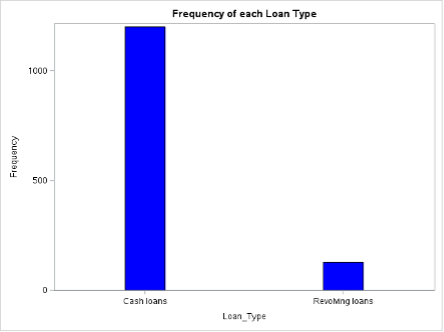
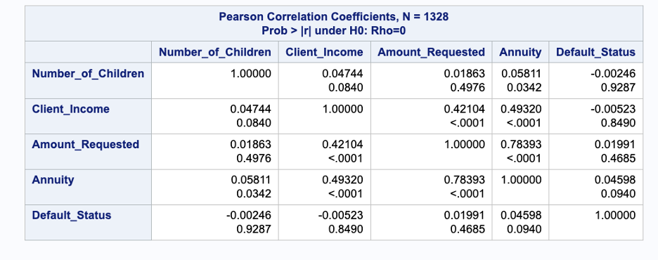
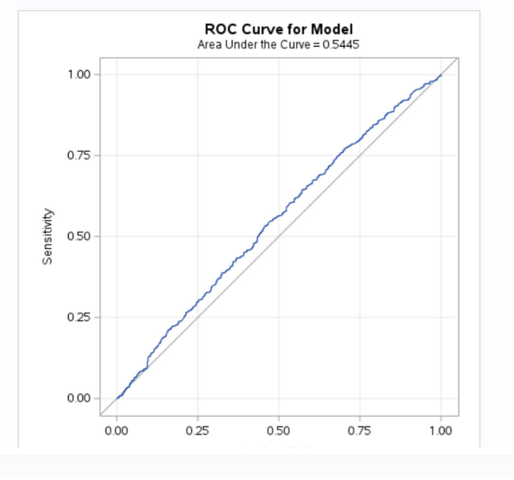
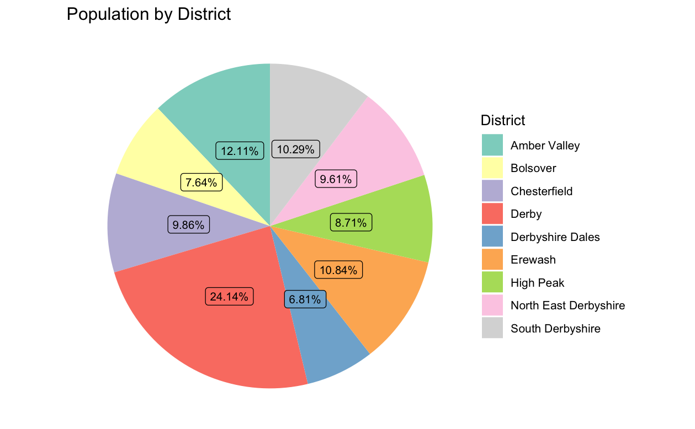
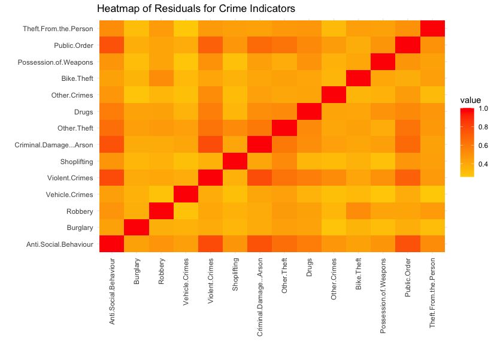
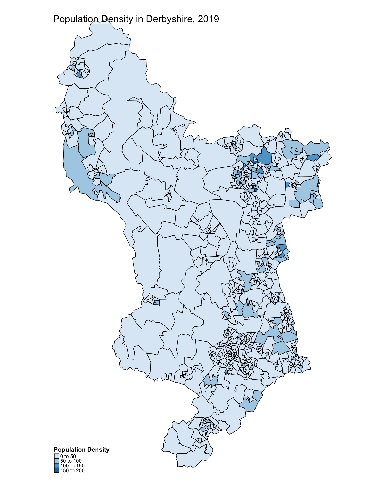
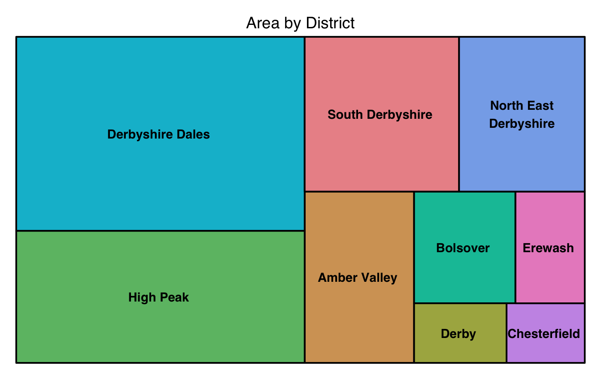
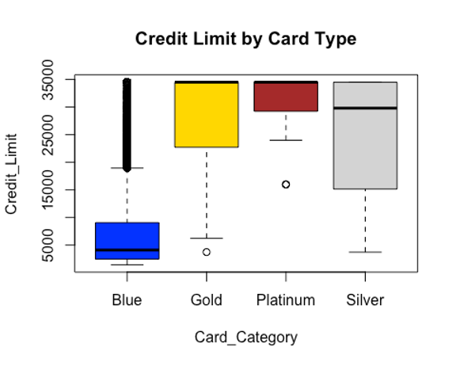
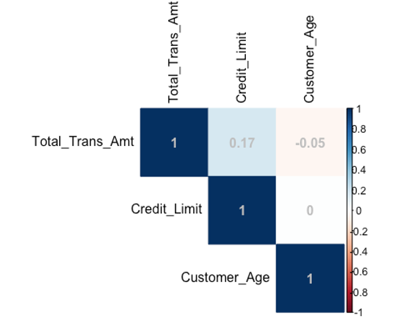
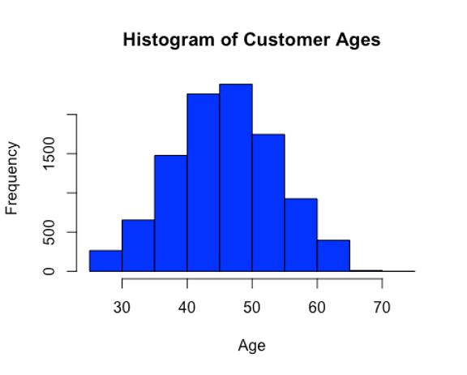

# Data Analyst

#### Technical Skills: Python, SQL, R Studio, SAS, Power BI, Excel 

### Education
- B.Sc Mathematics (First Class) | Delta State University (_November 2020_)
- M.Sc Big Data Analytics (Distinction)| University of Derby (_May 2024_)  

### Work Experience 
Business Data Analyst at Anheuser-Busch InBev
-  Utilised data visualisation tools like Power BI and R to make useful insights on business development.
-  Conducted data collection, cleaning, processing and analysis for procurement and sales team significantly influencing decision-making and ensuring the continuation of the business.
-  Conducted root cause analysis using Python and Excel to review logistic costs, resulting in savings exceeding 20% of the total procurement spend. 

## Projects
### Project 1: Loan Defaulters Analysis

In this project, I conducted a comprehensive analysis of loan defaulters using data sourced from Kaggle. The process began with data cleaning and transformation to ensure accuracy and reliability. I then performed Exploratory Data Analysis (EDA) to gain a deeper understanding of the dataset, focusing on key factors such as age, sex, and income.
To predict the likelihood of loan default, I developed a logistic regression model. This model was implemented using SAS, Python and R Studio, where I conducted preprocessing, visualization, and comparative analysis. Through this comparison, I highlighted the efficiency of Python in handling similar tasks.

The analysis led to the identification of actionable insights regarding default risk factors, which were thoroughly documented in a final report.

#### Key Contributions:

-  Data Analysis: Analyzed loan application data, ensuring data integrity and accuracy using SAS, Python and R Studio.
-  Model Development: Created a logistic regression model to predict default probabilities.
-  Tool Utilization: Leveraged SAS, Python and R Studio for preprocessing, visualization, and model comparison.
-  Insights Generation: Identified key risk factors contributing to loan defaults and provided actionable insights for risk mitigation.

#### Some Visualizations

Bar chart showing the distribution of loan amounts.

Correlation of numerical variables.

#### Model Performance

ROC curve for the logistic regression model.

### Project 2: Crime Analysis and Population Distribution in Derbyshire
In this project, I conducted a thorough analysis of the 2019 population distribution and crime density across 642 regions in Derbyshire using R studio to better understand crime patterns. The process began with data preprocessing, cleaning, and exploratory data analysis (EDA) to ensure a solid understanding of the dataset.

#### Key Contributions:

-  Population Distribution Analysis: Analyzed population distribution across the 642 regions to identify potential links to crime patterns.
-  Correlation Exploration: Investigated correlations between population density and 14 crime variables, including Anti-Social Behaviour and Burglary.
-  Crime Variable Descriptions: Provided comprehensive descriptions of each crime variable to enhance understanding and context for further analysis.
-  Model Development: Established correlations between crime rates and population densities using linear regression models, aiding in the development of crime reduction strategies.
-  Data Visualization: Utilized a variety of visual tools, including histograms, scatterplots, treemaps, and geospatial maps, to effectively illustrate crime frequency and population distribution.

#### Some Visualizations

Pie chart of Population by District in Derbyshire, 2019

Heatmap of Residuals for Crime Indicators in Derbyshire, 2019

Population Density in Derbyshire, 2019

Tree map showing the area by district in Derbyshire, 2019

### Project 3: Bank Churners and Video Game Sales Data Analysis
In this project, I conducted a comprehensive statistical analysis of the bank churners and video game sales datasets using R Studio. The goal was to derive meaningful insights into customer behavior and sales trends through a series of rigorous statistical tests and modeling techniques.

#### Bank Churners Analysis
Data Overview: Analyzed a dataset comprising 10,127 bank customers, focusing on attributes such as age, credit limit, and transaction behavior to understand factors influencing customer attrition.

-  One-Sample T-Test: Conducted a test to determine if the average age of customers deviates from 45 years. The analysis revealed a statistically significant difference, indicating that the average age is not 45.
-  Welch Two-Sample T-Test: Compared credit limits between male and female customers. Results showed a significant difference, with males having higher average credit limits than females.
-  ANOVA Test: Evaluated if credit limits vary across different card categories. The analysis demonstrated significant variability in credit limits among categories.
-  Linear Regression: Investigated the relationship between credit limit, customer age, and total transaction amount. The model identified credit limit and age as significant predictors, though the overall model explained only a small portion of the variance.
-  Chi-Square Test: Examined the independence of customer attrition from marital status. The test indicated no significant relationship between these variables.
-  Logistic Regression: Identified key predictors of customer attrition, including total transaction amount, gender, and card category. Age and credit limit were found to be non-significant in predicting attrition.

#### Video Game Sales Analysis
Data Overview: Analyzed video game sales data to explore sales trends across various platforms and genres globally.

-  Exploratory Analysis: Examined sales patterns, identifying Nintendo as a dominant player in global sales and highlighting popular genres like sports and platform games.
-  Correlation Exploration: Investigated relationships between sales figures in different regions and other variables to uncover significant sales trends and regional preferences.
-  Visualization: Created visual representations, such as histograms and scatterplots, to effectively communicate sales data trends and regional performance.

#### Some Visualizations

Box plot showing the Credit Limit by Card Type

Correlation Heatmap

Histogram of Customer Ages
